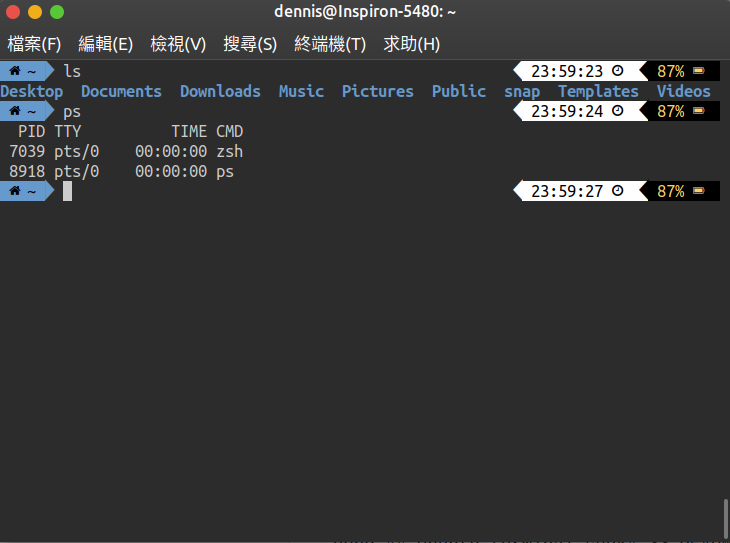

# Ubuntu bash shell suck



### Install Color scheme

Github: https://github.com/Mayccoll/Gogh

```bash
$ bash -c  "$(wget -qO- https://git.io/vQgMr)"
```

Use Tomorrow Night Eighties

Choose and change in edit > preference.

### powerline font

```bash
$ sudo apt-get install powerline
```

### Install nerd-fonts

```bash
wget https://github.com/ryanoasis/nerd-fonts/blob/master/patched-fonts/SourceCodePro/Regular/complete/Sauce%20Code%20Pro%20Nerd%20Font%20Complete%20Mono%20Windows%20Compatible.ttf

mv Sauce\ Code\ Pro\ Nerd\ Font\ Complete\ Mono\ Windows\ Compatible.ttf ~/.fonts/

sudo fc-cache -fv
```

### .bashrc .vimrc

In .bashrc

```bash
POWERLINE_SCRIPT=/usr/share/powerline/bindings/bash/powerline.sh
if [ -f $POWERLINE_SCRIPT ]; then
  source $POWERLINE_SCRIPT
fi
```

In .vimrc

```bash
set laststatus=2
set t_Co=256
python3 from powerline.vim import setup as powerline_setup
python3 powerline_setup()
python3 del powerline_setup
```

### zsh

```bash
sudo apt-get install zsh
cat /etc/shells
chsh -s /bin/zsh
```

Log out & log in

### oh-my-zsh

```
sh -c "$(wget https://raw.githubusercontent.com/robbyrussell/oh-my-zsh/master/tools/install.sh -O -)"
```

### zsh theme

zsh official themes suck

Use powerlevel9k instead

```
git clone https://github.com/bhilburn/powerlevel9k.git ~/.oh-my-zsh/custom/themes/powerlevel9k
```

In .zshrc

```
ZSH_THEME="powerlevel9k/powerlevel9k"

POWERLEVEL9K_LEFT_PROMPT_ELEMENTS=(dir dir_writable vcs)
POWERLEVEL9K_RIGHT_PROMPT_ELEMENTS=(status time)

POWERLEVEL9K_MODE='nerdfont-complete'
```
